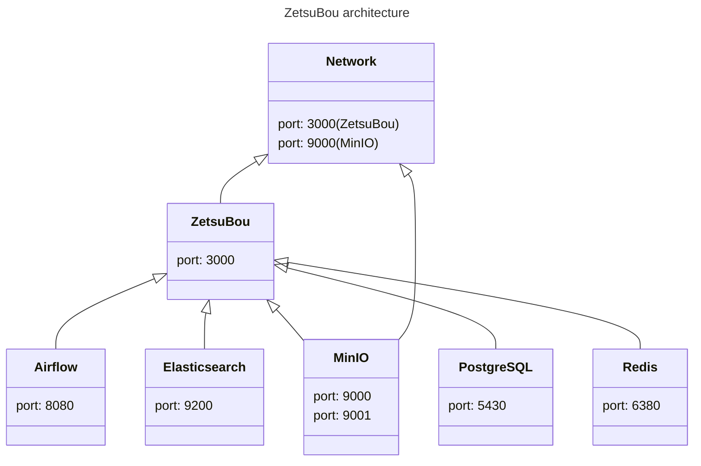

# ZetsuBou

[](https://www.python.org/downloads/release/python-3811/)
[](https://v3.vuejs.org/)
[](https://www.google.com/intl/en_us/chrome/)
[](https://www.google.com/intl/en_us/chrome/)

ZetsuBou is a web-based app to serve your own image galleries and videos.

**There would be no backward compatibility at all.**

This is written in Python 3 and Vue 3.

## ⚠️ Warning

ZetsuBou would generate `.tag` folder inside your galleries. Here is the folder structure.

```text
+-- Your image gallery 001
|   +-- .tag
|   |   +-- gallery.json
|   |   +-- ...
|   +-- 1.jpg
|   +-- 2.jpg
|   +-- ...
+-- Your image gallery 002
|   +-- .tag
|   |   +-- gallery.json
|   |   +-- ...
|   +-- 1.png
|   +-- 2.bmp
|   +-- 3.jpg
|   +-- ...
+-- ...
```

## Getting started

```bash
# To build docker image
make build
# To initialize airflow and create `./etc/settings.env` and `./etc/settings.airflow.env`
make init
# To close the services started during initialization
make down

# To start the services
make up
```

## Development

### Architecture



### Set environment

```bash
# To install commitlint
npm install --save-dev @commitlint/{cli,config-conventional} conventional-changelog prettier prettier-eslint
# To test commitlint
npx commitlint --from "HEAD~1" --to "HEAD" --verbose
```

### Build

```bash
# To build docker images and so on
make build
# To install python packages
poetry install
# To inject pre-commit into git
pre-commit install
```

### Run

```bash
# To initialize the folders and airflow
make init
# To run the services
make up-dev
# To run the app
poetry run python app.py
# (Optional) To run standalone
poetry run python standalone.py
```

### Run before push

```bash
# To format the files
make lint
```

## Contact

[My twitch channel](https://www.twitch.tv/demonic22)
