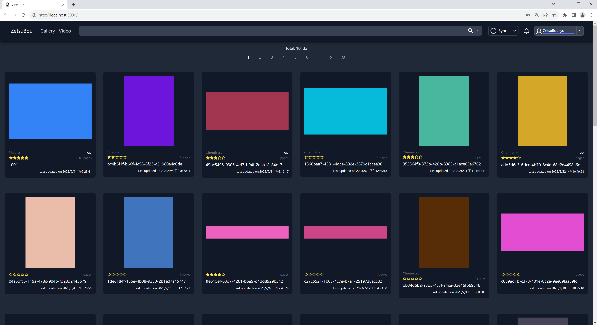
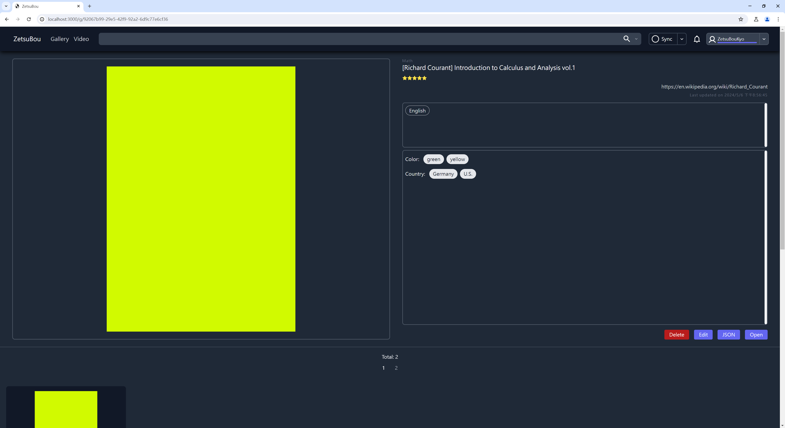
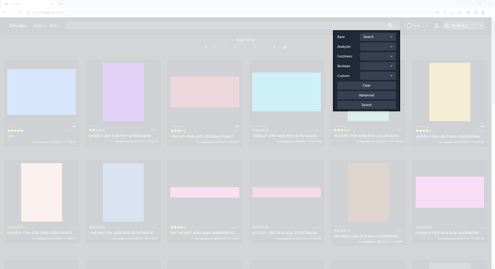
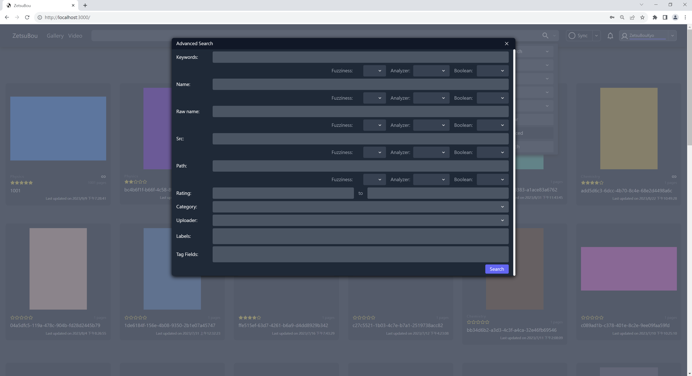

# ZetsuBou

[](https://www.python.org/downloads/release/python-3811/)
[](https://v3.vuejs.org/)
[](https://www.google.com/intl/en_us/chrome/)
[](https://www.google.com/intl/en_us/chrome/)

[ZetsuBou](https://zetsuboukyo.github.io/) is a self-hosted and web-based application designed to fulfill your needs for
managing the image galleries and videos.

The application is developed using Python 3 and Vue 3. Its core search mechanism relies on the Elasticsearch engine with
custom [analyzers, filters, and mappings](back/init/async_elasticsearch.py), enabling us to execute complex queries on
the image, gallery, and video collections effectively.

**There would be no backwards compatibility at all.**

## Previews

### Galleries

On the galleries homepage, we display each gallery along with its cover image, name, page count, rating, last-modified
date, and so on.



### Gallery

The left side shows the cover image, while the right side lists details such as name, raw name, source link, rating,
labels, tags, and other relevant information. There are also buttons for various features. At the bottom of the page
you'll find the images contained in the gallery.



### Search

We offer various user interfaces (UIs) that provide different search mechanisms. Here are a few examples.




## ⚠️ Warning

ZetsuBou will create a `.tag` folder within your galleries. Here's an example of the folder structure.

```text
<your image galleries>
├── <your image gallery 001>
│   ├── 1.jpg
│   ├── 2.jpg
│   ├── 3.jpg
│   ├── 4.jpg
│   ├── 5.jpg
│   └── .tag
│       └── gallery.json
└── <your image gallery 002>
    ├── 1.jpg
    ├── 2.jpg
    ├── 3.jpg
    ├── 4.jpg
    └── .tag
        └── gallery.json
```

## Getting started

### Run example

```bash
# To clone the repo
git clone https://github.com/ZetsuBouKyo/ZetsuBou
# To build the docker images
make build
# To create the folders and `./etc/analysis/synonym.txt`
make init
# To start the services
make up
# To stop the services
make down
```

You can find the ZetusBou webapp username `ZETSUBOU_APP_ADMIN_EMAIL`, password `ZETSUBOU_APP_ADMIN_PASSWORD`, and other
pertinent information of environement variables in `./etc/settings.env`.

## Contact

[My twitch channel](https://www.twitch.tv/zetsuboukyo)
