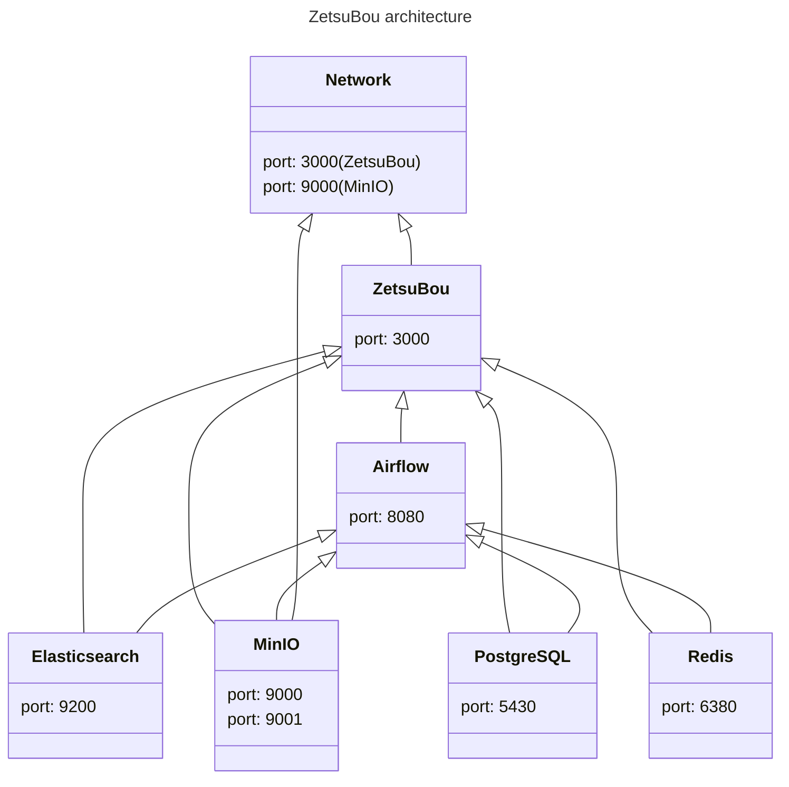

# Architecture

| Services      | Description                                                                |
| ------------- | -------------------------------------------------------------------------- |
| Airflow       | Manage the tasks, e.g. synchronization, creating a video cover, and so on. |
| Elasticsearch | Search engine.                                                             |
| MinIO         | An object storage for hosting images, videos, and files.                   |
| PostgreSQL    | An object-relational database.                                             |
| Redis         | Maintain the status of tasks.                                              |
