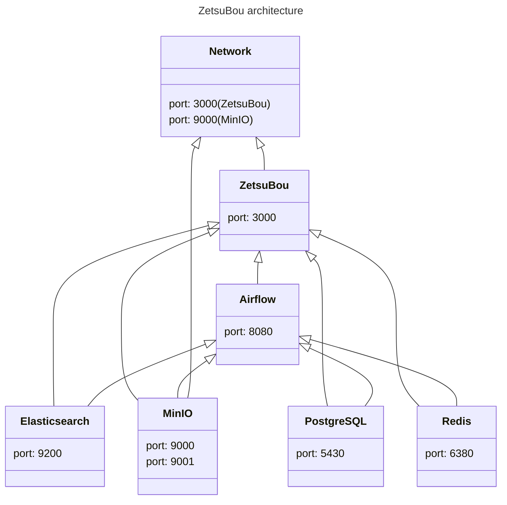

# Architecture

```mermaid
---
title: ZetsuBou architecture
---
classDiagram
    class Network {
        port: 3000 (ZetsuBou)
        port: 9000 (MinIO)
    }
    class ZetsuBou{
        port: 3000
    }
    class Airflow{
        port: 8080
    }
    class Elasticsearch{
        port: 9200
    }
    class MinIO{
        port: 9000
        port: 9001
    }
    class PostgreSQL{
        port: 5430
    }
    class Redis{
        port: 6380
    }
    ZetsuBou <|-- Airflow
    ZetsuBou <|-- Elasticsearch
    ZetsuBou <|-- MinIO
    ZetsuBou <|-- PostgreSQL
    ZetsuBou <|-- Redis
    Airflow <|-- Elasticsearch
    Airflow <|-- MinIO
    Airflow <|-- PostgreSQL
    Airflow <|-- Redis
    Network <|-- ZetsuBou
    Network <|-- MinIO
```
