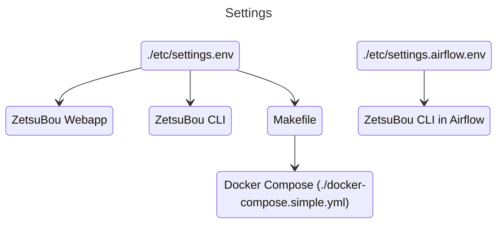

# Settings

## Work flow

```mermaid
---
title: Settings
---
stateDiagram-v2

zetsubou_webapp: ZetsuBou Webapp
zetsubou_cli: ZetsuBou CLI
zetsubou_airflow_cli: ZetsuBou CLI in Airflow
makefile: Makefile
docker_compose: Docker Compose (./docker-compose.simple.yml)

zetsubou_file: ./etc/settings.env
airflow_file: ./etc/settings.airflow.env

zetsubou_file --> zetsubou_webapp
zetsubou_file --> zetsubou_cli
zetsubou_file --> makefile
makefile --> docker_compose

airflow_file --> zetsubou_airflow_cli
```
