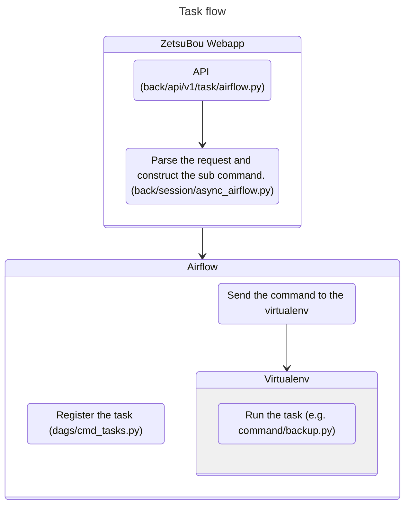

# Task

## Workflow

```mermaid
---
title: Task flow
---
stateDiagram-v2
zetsubou: ZetsuBou Webapp
state zetsubou {
  api: API (back/api/v1/task/airflow.py)
  parse: Parse the request and construct the sub command. (back/session/async_airflow.py)
  api --> parse
}

state Airflow {
  register: Register the task (dags/cmd_tasks.py)
  trigger: Send the command to the virtualenv

  airflow_env: Virtualenv
  state airflow_env {
    run: Run the task (e.g. command/backup.py)

  }
  trigger --> airflow_env
}

zetsubou --> Airflow
```

### Virtualenv

This is a python virtualenv inside the Airflow docker. Airflow and this virtualenv
should run in the same operating system environment.
