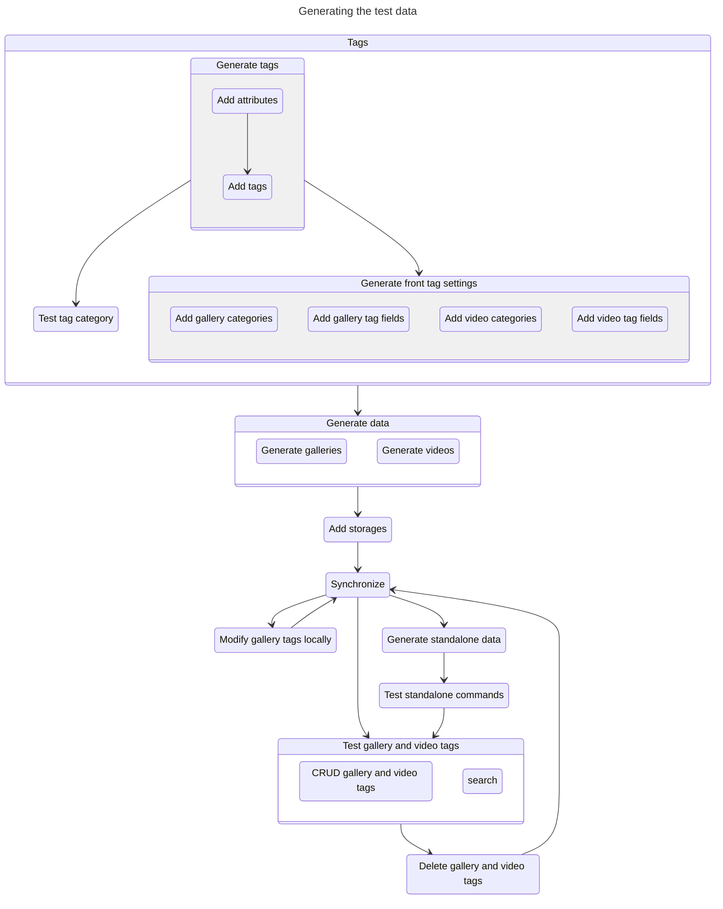

# Tests

## Integration

## Search

## Pagination

Here are the scenarios when we use pagination.

- Gallery previews
  - Default
  - Search
  - Advanced search
- Preview images in gallery
- Video previews
- Bookmark
- CRUD table

## Gallery

### Synchronize

- If the JSON file in the gallery is different from the document in Elasticsearch, we
  should base on the JSON file and update the document in Elasticsearch.
- If the gallery is deleted from storage, the document must also be deleted from
  Elasticsearch.
