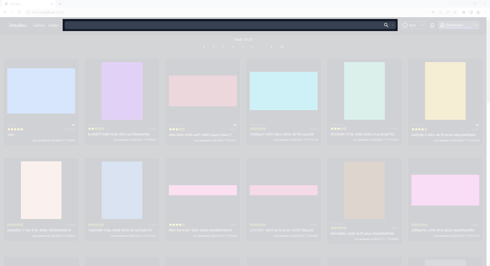
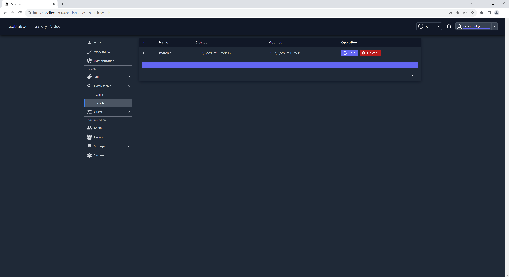
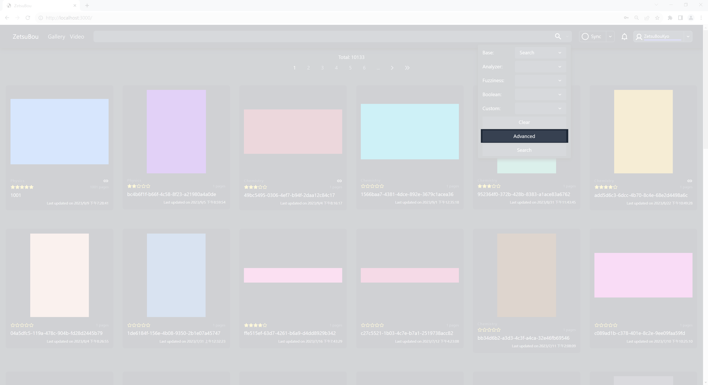

# Introduction

Our search mechanism is based on Elasticsearch. We store the gallery, video, and tag
information in JSON format.

There are 3 ways to search the content in the Web UI.

- [Search in the top input element of the navigation.](#normal-search)
- [Search in the top input element of the navigation with additional parameters.](#with-additional-parameters)
- [Advanced search.](#advanced-search)

## Normal search

The HTML input element in the top navigation is the entry point for the text search.
It supports some special search grammar, e.g. including or excluding field value under
specific field name.

??? note "Field name and field value"

    For example, we have a JSON file:

    ```json
    {
        ...
        "tags": {
            "langauge": ["Chinese", "English"]
        }
        ...
    }
    ```

    `tags` is the field name. `Chinese` or `English` is the field value.

??? note "Web screenshot"

    

### Grammar

#### Special character

| Operator | Description                                                                        |
| -------- | ---------------------------------------------------------------------------------- |
| `-`      | Exclude for field name or field value under specific field name.                   |
| `"`      | Everything between the quotes after the `=` character is treated as a field value. |
| `=`      | Separator for field name and field value.                                          |

#### Examples

??? note "Developer notes"

    This section is generated by
    `python cli.py build docs print-search-grammar-examples`.

- Excludes all documents that have a `tags.language` field.

=== "Input"

    ```sh
    -tags.language
    ```

=== "Elasticsearch"

    ```json
    {
        "bool": {
            "should": [],
            "must_not": [
                {
                    "exists": {
                        "field": "tags.language"
                    }
                }
            ]
        }
    }
    ```

- Excludes documents that have an `english` value in a `tags.language` field.

=== "Input"

    ```sh
    -tags.language=english
    ```

    or

    ```sh
    -tags.language="english"
    ```

    or

    ```sh
    -"tags.language"=english
    ```

    or

    ```sh
    -"tags.language"="english"
    ```

=== "Elasticsearch"

    ```json
    {
        "bool": {
            "should": [],
            "must_not": [
                {
                    "term": {
                        "tags.language.keyword": {
                            "value": "english"
                        }
                    }
                }
            ]
        }
    }
    ```

- Includes documents that have a `中文` value in a `tags.language` field.

=== "Input"

    ```sh
    tags.language=中文
    ```

    or

    ```sh
    tags.language="中文"
    ```

    or

    ```sh
    "tags.language"=中文
    ```

    or

    ```sh
    "tags.language"="中文"
    ```

=== "Elasticsearch"

    ```json
    {
        "bool": {
            "should": [
                {
                    "constant_score": {
                        "filter": {
                            "multi_match": {
                                "query": "中文",
                                "fuzziness": 0,
                                "fields": "tags.language.*"
                            }
                        }
                    }
                }
            ],
            "must_not": []
        }
    }
    ```

- Includes documents that have a `=中文` value in a `tags.language` field.

=== "Input"

    ```sh
    tags.language==中文
    ```

=== "Elasticsearch"

    ```json
    {
        "bool": {
            "should": [
                {
                    "constant_score": {
                        "filter": {
                            "multi_match": {
                                "query": "=中文",
                                "fuzziness": 0,
                                "fields": "tags.language.*"
                            }
                        }
                    }
                }
            ],
            "must_not": []
        }
    }
    ```

- Includes documents that have a `=中=文=` value in a `tags.language` field.

=== "Input"

    ```sh
    tags.language==中=文=
    ```

=== "Elasticsearch"

    ```json
    {
        "bool": {
            "should": [
                {
                    "constant_score": {
                        "filter": {
                            "multi_match": {
                                "query": "=中=文=",
                                "fuzziness": 0,
                                "fields": "tags.language.*"
                            }
                        }
                    }
                }
            ],
            "must_not": []
        }
    }
    ```

- Includes documents that have an `English (UK)` value in a `tags.language` field.

=== "Input"

    ```sh
    tags.language="English (UK)"
    ```

=== "Elasticsearch"

    ```json
    {
        "bool": {
            "should": [
                {
                    "constant_score": {
                        "filter": {
                            "multi_match": {
                                "query": "English (UK)",
                                "fuzziness": 0,
                                "fields": "tags.language.*"
                            }
                        }
                    }
                }
            ],
            "must_not": []
        }
    }
    ```

- If there is an odd number of quotes, it is treated as a normal keyword string.

=== "Input"

    ```sh
    "["社會" (歷史)] 今天天氣真好=(三國演義) [Chn]
    ```

=== "Elasticsearch"

    ```json
    {
        "bool": {
            "should": [
                {
                    "constant_score": {
                        "filter": {
                            "multi_match": {
                                "query": "\"[\"社會\"",
                                "fuzziness": 0,
                                "fields": [
                                    "tags.*"
                                ]
                            }
                        }
                    }
                },
                {
                    "constant_score": {
                        "filter": {
                            "multi_match": {
                                "query": "(歷史)]",
                                "fuzziness": 0,
                                "fields": [
                                    "tags.*"
                                ]
                            }
                        }
                    }
                },
                {
                    "constant_score": {
                        "filter": {
                            "multi_match": {
                                "query": "今天天氣真好=(三國演義)",
                                "fuzziness": 0,
                                "fields": [
                                    "tags.*"
                                ]
                            }
                        }
                    }
                },
                {
                    "constant_score": {
                        "filter": {
                            "multi_match": {
                                "query": "[Chn]",
                                "fuzziness": 0,
                                "fields": [
                                    "tags.*"
                                ]
                            }
                        }
                    }
                }
            ],
            "must_not": []
        }
    }
    ```

---

## With additional parameters

At the end of the top input navigation, near the magnifier icon, there is a
rounded-expand-more icon. Click on the rounded-expand-more icon to expand the dropdown.

??? note "Web screenshot"

    

Here are the parameters.

| Parameter               | Description                                         |
| ----------------------- | --------------------------------------------------- |
| [Base](#base)           | The order of returning results.                     |
| [Analyzer](#analyzer)   | The algorithm used to convert the text into tokens. |
| [Fuzziness](#fuzziness) | Fuzziness[^1] of the text search.                   |
| [Boolean](#boolean)     | The relationship between keywords.                  |
| [Custom](#custom)       | The custom Elasticsearch query.                     |

### Additional parameters

#### Base

`Search` performs the default search which will split the input text with space and
searches that splitted keywords in mutiple fields.

`Random` will return the same results as Search, but they will be returned randomly.

#### Analyzer

The word `Analyzer` has two meanings in ZetsuBou. One is the `Elasticsearch Analyzer`
and the other is the `Web Search Analyzer`.

` Elasticsearch Analyzer` is a field name of the form `*.<analyzer>`. For example,
`raw_name.default` means field name `raw_name` and analyzer `default`.

`Web Search Analyzer` is a dropdown list in the Web UI. It is a combination of the
`Elasticsearch Analyzer`.

??? note "Developer notes"

    You can see the following tabs in JSON format by
    `python cli.py build docs print-web-search-analyzer`.

The following two tabs are the details of `Web Search Analyzer`.

=== "Gallery"

    Default

    | Full field name     | Field name          | Elasticsearch analyzer |
    | ------------------- | ------------------- | ---------------------- |
    | path.url            | path                | url                    |
    | name.default        | name                | default                |
    | raw_name.default    | raw_name            | default                |
    | other_names.default | other_names         | default                |
    | src.url             | src                 | url                    |
    | attributes.category | attributes.category | keyword                |
    | attributes.uploader | attributes.uploader | keyword                |
    | labels              | labels              | keyword                |
    | tags.\*             | tags.\*             | keyword                |

    Keyword

    | Full field name     | Field name          | Elasticsearch analyzer |
    | ------------------- | ------------------- | ---------------------- |
    | path.keyword        | path                | keyword                |
    | name.keyword        | name                | keyword                |
    | raw_name.keyword    | raw_name            | keyword                |
    | other_names.keyword | other_names         | keyword                |
    | src.keyword         | src                 | keyword                |
    | attributes.category | attributes.category | keyword                |
    | attributes.uploader | attributes.uploader | keyword                |
    | labels              | labels              | keyword                |
    | tags.\*             | tags.\*             | keyword                |

    Ngram

    | Full field name     | Field name          | Elasticsearch analyzer |
    | ------------------- | ------------------- | ---------------------- |
    | path.ngram          | path                | ngram                  |
    | name.ngram          | name                | ngram                  |
    | raw_name.ngram      | raw_name            | ngram                  |
    | other_names.ngram   | other_names         | ngram                  |
    | src.ngram           | src                 | ngram                  |
    | attributes.category | attributes.category | keyword                |
    | attributes.uploader | attributes.uploader | keyword                |
    | labels              | labels              | keyword                |
    | tags.\*             | tags.\*             | keyword                |

    Standard

    | Full field name      | Field name          | Elasticsearch analyzer |
    | -------------------- | ------------------- | ---------------------- |
    | path.standard        | path                | standard               |
    | name.standard        | name                | standard               |
    | raw_name.standard    | raw_name            | standard               |
    | other_names.standard | other_names         | standard               |
    | src.standard         | src                 | standard               |
    | attributes.category  | attributes.category | keyword                |
    | attributes.uploader  | attributes.uploader | keyword                |
    | labels               | labels              | keyword                |
    | tags.\*              | tags.\*             | keyword                |

    URL

    | Full field name | Field name | Elasticsearch analyzer |
    | --------------- | ---------- | ---------------------- |
    | path.url        | path       | url                    |
    | src.url         | src        | url                    |

=== "Video"

    Default

    | Full field name     | Field name          | Elasticsearch analyzer |
    | ------------------- | ------------------- | ---------------------- |
    | path.url            | path                | url                    |
    | name.default        | name                | default                |
    | raw_name.default    | raw_name            | default                |
    | other_names.default | other_names         | default                |
    | src.url             | src                 | url                    |
    | attributes.category | attributes.category | keyword                |
    | attributes.uploader | attributes.uploader | keyword                |
    | labels              | labels              | keyword                |
    | tags.\*             | tags.\*             | keyword                |

    Keyword

    | Full field name     | Field name          | Elasticsearch analyzer |
    | ------------------- | ------------------- | ---------------------- |
    | path.keyword        | path                | keyword                |
    | name.keyword        | name                | keyword                |
    | raw_name.keyword    | raw_name            | keyword                |
    | other_names.keyword | other_names         | keyword                |
    | src.keyword         | src                 | keyword                |
    | attributes.category | attributes.category | keyword                |
    | attributes.uploader | attributes.uploader | keyword                |
    | labels              | labels              | keyword                |
    | tags.\*             | tags.\*             | keyword                |

    Ngram

    | Full field name     | Field name          | Elasticsearch analyzer |
    | ------------------- | ------------------- | ---------------------- |
    | path.ngram          | path                | ngram                  |
    | name.ngram          | name                | ngram                  |
    | raw_name.ngram      | raw_name            | ngram                  |
    | other_names.ngram   | other_names         | ngram                  |
    | src.ngram           | src                 | ngram                  |
    | attributes.category | attributes.category | keyword                |
    | attributes.uploader | attributes.uploader | keyword                |
    | labels              | labels              | keyword                |
    | tags.\*             | tags.\*             | keyword                |

    Standard

    | Full field name      | Field name          | Elasticsearch analyzer |
    | -------------------- | ------------------- | ---------------------- |
    | path.standard        | path                | standard               |
    | name.standard        | name                | standard               |
    | raw_name.standard    | raw_name            | standard               |
    | other_names.standard | other_names         | standard               |
    | src.standard         | src                 | standard               |
    | attributes.category  | attributes.category | keyword                |
    | attributes.uploader  | attributes.uploader | keyword                |
    | labels               | labels              | keyword                |
    | tags.\*              | tags.\*             | keyword                |

    URL

    | Full field name | Field name | Elasticsearch analyzer |
    | --------------- | ---------- | ---------------------- |
    | path.url        | path       | url                    |
    | src.url         | src        | url                    |

#### Fuzziness

The fuzziness value represents the minimum steps from one text sequence to another.^[2]

#### Boolean

The default value is `Should`, which means it will return the results that match any of
the keywords under any of the field names.

`Must` means that all tokens must be hit.

#### Custom

Users can create their own Elasticsearch query at
`http://localhost:3000/settings/elasticsearch-search`.

??? note "Web screenshot"

    

---

## Advanced search

Similar to searching with additional parameters, but more detailed.

??? note "Web screenshot"

    
    

[^1]: https://www.elastic.co/guide/en/elasticsearch/reference/current/common-options.html#fuzziness
[^2]: https://en.wikipedia.org/wiki/Levenshtein_distance ↩
