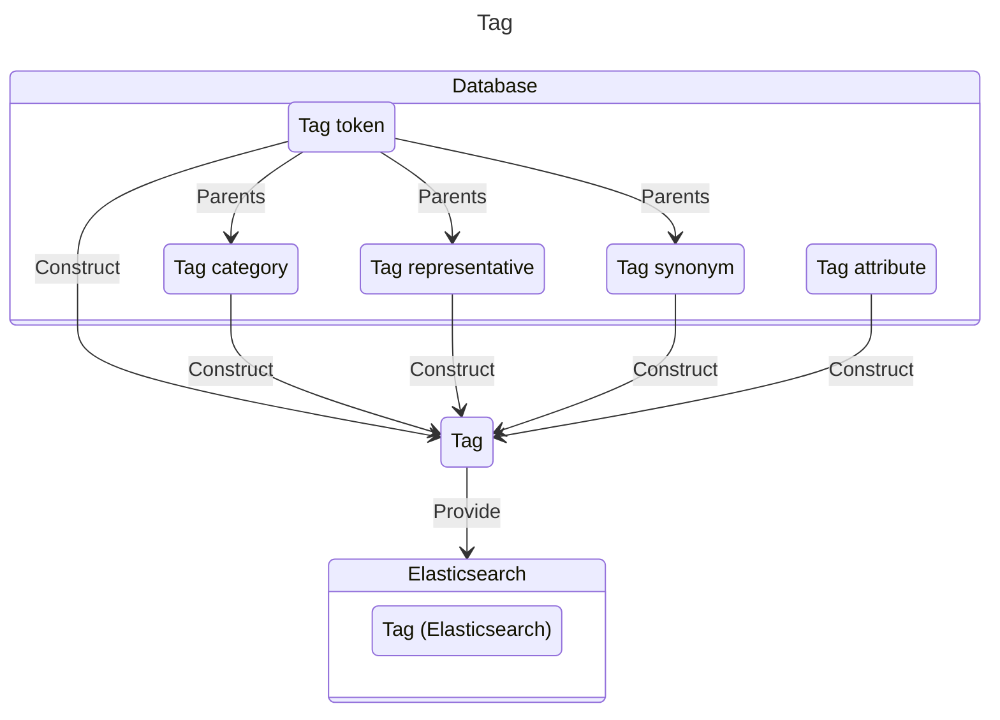

# Introduction

## Disambiguation

- Tag
- Gallery tag
- Video tag

## Mechanism

```mermaid
---
title: Tag
---
stateDiagram-v2

state SQL Database {
  token: Tag token
  tag_category: Tag category
  tag_representative: Tag representative
  tag_synonym: Tag synonym
  tag_attribute: Tag attribute

  token --> tag_category: Parents
  token --> tag_representative: Parents
  token --> tag_synonym: Parents
}

tag: Tag
token --> tag: Construct
tag_category --> tag: Construct
tag_representative --> tag: Construct
tag_synonym --> tag: Construct
tag_attribute --> tag: Construct

state Elasticsearch {
  tag_elasticsearch: Tag (Elasticsearch)
}

tag --> Elasticsearch: Provide


```
